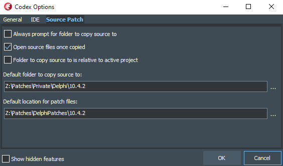

## Delphi Patches

This repository is a collection of patch files that can be applied to Delphi source to resolve various issues

### What are the patch files?

The patch files are created by modifying the Delphi source, then using the `git diff` command from [Git](https://git-scm.com/) to generate differences between the original and the modification.

The naming convention used for patch files is:

* Original source file name minus the extension, plus
* Quality Portal report number, if applicable, plus
* Delphi version that the patch applies to (e.g. 10.4.2), plus
* `.patch` extension

e.g. FMX.Canvas.D2D.RSP-17030.10.4.2.patch is a patch for FMX.Canvas.D2D.pas for an issue reported [here](https://quality.embarcadero.com/browse/RSP-17030), and applies to Delphi 10.4.2

Patches in this repository will contain non-breaking changes only, i.e. there will be no patches that include changes to the `interface` section of a unit. This is to reduce the likelihood that other unchanged source needs to be in the compiler path.

### Who creates the patch files?

The patch files are created by Dave Nottage of Delphi Worlds, and anyone else that wishes to contribute

### Why create patch files?

To solve issues in the Delphi source, of course! Also, Delphi source files (excluding auto-generated source, e.g. many of the API imports) are copyrighted, so entire files cannot be distributed publicly without permission

### How to apply the patch files

Since the patch files are generated by using Git, it is recommended that you [install Git](https://git-scm.com/download/win) (even if you do not use it for source control), which includes a function that can be used to apply the patches

To make patching source files a breeze, the [Codex Delphi add-in](https://github.com/DelphiWorlds/Codex) has been updated (version 1.4) to include this functionality. Here's a step-by-step:

* Clone this repo
* Install [Codex 1.4](https://github.com/DelphiWorlds/Codex/blob/master/Bin/CodexSetup_1.4.0.exe) (close Delphi first)
* Open Delphi, go to Tools|Codex|Options, Source Patch tab, configure `Default location for patch files` to the repo location and configure the other options as applicable, e.g.:

When a patch (or patches) becomes available, in Delphi go to Tools|Codex|Source Patch > Patch source, select a patch file, and click Open. Codex will then:

* Attempt to find a source file that matches the patch file name. This is why they start with the original filename, and end with an extension of the applicable Delphi version, then `.patch`
* If a matching source file is not found, Codex will prompt you to select the relevant source file
* If a matching source file is found, Codex will copy the original source into the location configured in the Codex > Source Patch options, or will prompt for a location to copy to
* Codex will then apply the patch to the copy of the source

Codex makes a copy of the source file before applying the patch because it is good practice to leave the originals intact 

You can patch the source manually if you choose to; just remember that the tool you use to apply the patches needs to understand the format of the patch file

